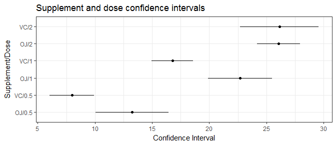

# Statistical Inference - Inferential Data Analysis
Silva, RAFAEL  
December 4, 2017  

## Setup


This section presents all the libraries used during the project.


```r
library(datasets)
library(ggplot2)
library(dplyr)
library(tidyr)
library(knitr)
```

## Introduction

The objective of this project is to make some inferences about the length variation on each supplement and dose on the ToothGrowth data from the R datasets package. The análysis is going to follow the four steps below:

1. Exploratory data analysis and summary;
1. Confidence intervals;
1. Conclusions and assumptions.

The chunk bellow is used to read the data set into the workspace.


```r
data("ToothGrowth")
```

For more information on the data set (description, dimensions, variables and source) enter ?ToothGrowth on the console to check its documentation.

## Exploratory analysis

To start the analysis, a brief verification on how the dataset looks like is necessary.


```r
dim(ToothGrowth)
```

```
## [1] 60  3
```


```r
head(ToothGrowth)
```

```
##    len supp dose
## 1  4.2   VC  0.5
## 2 11.5   VC  0.5
## 3  7.3   VC  0.5
## 4  5.8   VC  0.5
## 5  6.4   VC  0.5
## 6 10.0   VC  0.5
```

As the outputs above show, the data set has 60 observations on 3 variables. As the instroduction chapter states, the objective is to make some inferences about the length variation on each supplement and dose. The boxplot below gives a feeling about how each combination affects the length variable.


```r
ggplot(ToothGrowth, aes(x = interaction(supp, dose), y = len)) + 
      geom_boxplot() + 
      labs(title = "Length by supplement and dose", 
           x = "Supplement.Dose", y = "Length")
```


In the table below, the main statistical attributes of each group are summarized.


```r
summ <- ToothGrowth %>%
      mutate(suppDose = interaction(supp, dose))%>%
      group_by(suppDose) %>%
      summarise(mean = mean(len), 
                median = median(len),
                variance = round(var(len),3), 
                n = length(len))

kable(summ, caption = "Data Summary by Supplement and Dose", 
      col.names = c("Supp/Dose", "Mean", "Median", "Variance", "n"))
```


Table: Data Summary by Supplement and Dose

Supp/Dose     Mean   Median   Variance    n
----------  ------  -------  ---------  ---
OJ.0.5       13.23    12.25     19.889   10
VC.0.5        7.98     7.15      7.544   10
OJ.1         22.70    23.45     15.296   10
VC.1         16.77    16.50      6.327   10
OJ.2         26.06    25.95      7.049   10
VC.2         26.14    25.95     23.018   10

With the summary presented above, it is possible to manualy calculate the confidence interval (Z or T) for all the groups, besides that, it is also possible to perform an equivalence test on each combination.

## Hypothesis test

In this section, each group will have it's confidence intervals calculated and ploted along with its mean. The coonfidence intervals are represented by the lines and the means by the dots.


```r
results <- summ %>%
      mutate(lowerCI = mean - qt(.975, n-1) * sqrt(variance/n),
             upperCI = mean + qt(.975, n-1) * sqrt(variance/n)) %>%
      select(c("suppDose", "mean", "lowerCI", "upperCI")) %>%
      gather(lowUP, confInt, c("lowerCI", "upperCI"))

ggplot(results) +
      geom_line(aes(y = suppDose, x = confInt, group = suppDose)) +
      geom_point(aes(y = suppDose, x = mean)) +
      labs(x = "Confidence Interval", y = "Supplement.Dose", 
           title = "Supplement and dose confidence intervals") +
      theme_bw()
```



## Conclusion

By looking at the plot on the last section, it is possible to make some assumptions about the data:

1. Reject for H~0~:$\mu$~OJ.0.5~=$\mu$~VC.0.5~;
1. Reject for H~0~:$\mu$~OJ.1~=$\mu$~VC.1~;
1. Fail to reject for H~0~:$\mu$~OJ.2~=$\mu$~VC.2~.
